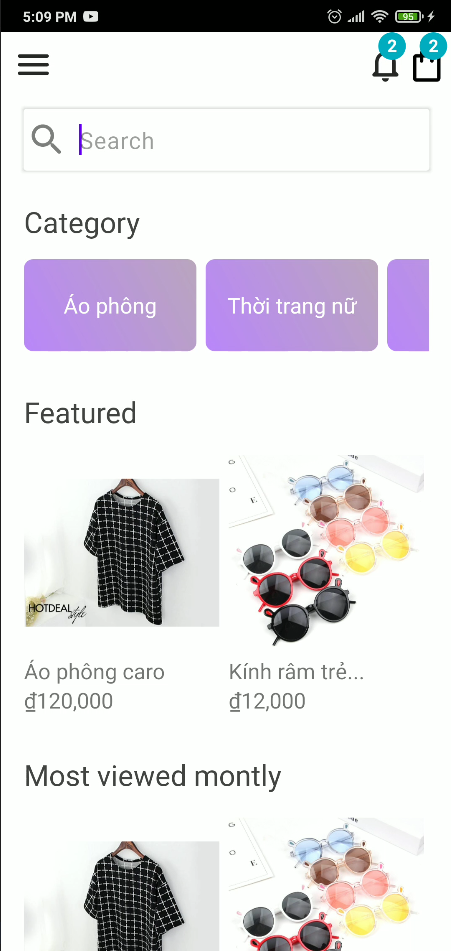
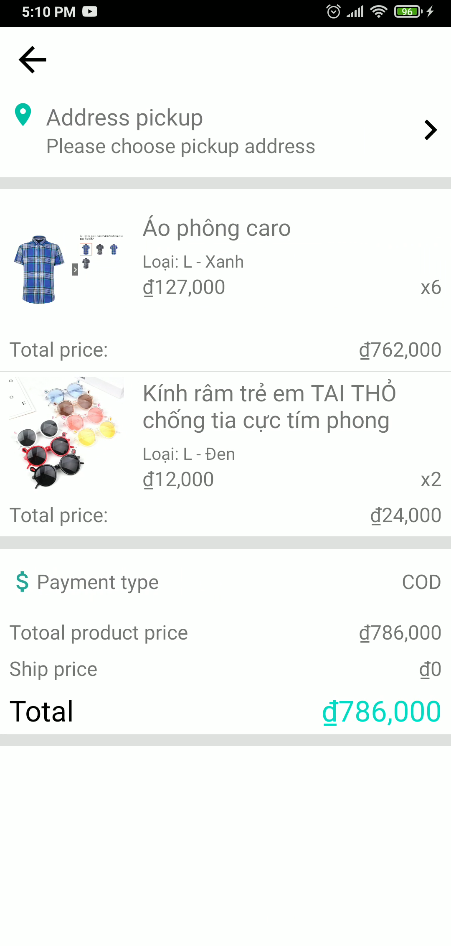

# Android - Kotlin

This project for learning to build an android app with kotlin \
### Architecture
- MVVM
- Repository Pattern
- Clean Architecture
### Techs
- Kotlin
- Coroutine
- Dependency injection with Hilt
- Firebase
	- Firestore
	- Firebase cloud messaging
	- Firebase analytic
- Firestore realtime with kotlin flow
- Algolia

### Functions
- Fulltext search
- Authentication
- Cart
- Order
- Order delivery status
- Pickup address
- Add review
- Messaging with admin
- Live video
- Push notification
- Notifications

# Result
Home

Product

Cart

Order

Live video

[and more](/screenshots)